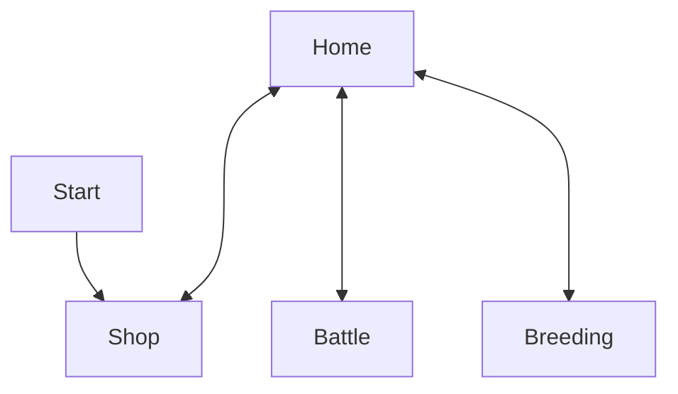

# Brainstorm

Theme: firefly

firefly farmer

- breed new types of fireflies
  
  - breed your fireflies with fireflies from other wizards
  
  - buy basic firefly for X amount
  
  - when you breed them, one of them dies
    
    - (maybe ignore genders in-game)
    
    - should help prevent overpopulation/too many to deal with
    
    - there's a % chance of one dying. Not every time.
      
      - makes it a gamble to buy vs breed
    
    - new firefly has their stats slightly randomized
      
      - look at minecraft horse breeding math
  
  - buying basic/starter fireflies and firefly buffs and hats is done in the same place
  
  - mutations
    
    - color of the firefly
    
    - size (or size depends on a stat, like strength)
    
    - wing design (if we get that many assets)

- slime rancher

- wizard frog

- firefly market
  
  - sell fireflies
  
  - get upgrades
    
    - "breeds 15% faster"
    
    - "shines 3x more"
    
    - vitamins for increasing stats
  
  - wizard hats
  
  - firefly hats
  
  - firefly particle effects/trail effect
  
  - wizard frog sits in the shop, welcoming you

- win state
  
  - buy everything from the shop
  
  - gain X amount of frog-dollars

- trade fireflies with other firefly zero users

- use fireflies for something
  
  - battle
    
    - different skills for your fireflies
      
      - strength
      
      - health
    
    - triathalon
      
      - bring team of fireflies, each specialized for different skillsets
      
      - you need to breed different branches of fireflies to have the best team
  
  - fireflies gain a little skills when battling
    
    - but drugs are stronger

- "fireflyathon"
  
  - race
    
    - speed
    
    - slope/hill-race games
      
      - speed + how fast the firefly can dive
      
      - tree tops
    
    - top down
      
      - dodge the trees
      
      - speed & dexterity/agility/nimbleness ✨
    
    - map
      
      - tiles
      
      - one big map in image editor
        
        - different layer per object or somthing
      
      - collision with trees
  
  - beauty contest
    
    - prettiest blinking
    
    - rhythm
      
      - simon says
    
    - agility contest (like dogs)
  
  - duel
    
    - strength
    
    - dodging
    
    - jousting
- AI competition
- Ranked games
  - rise up in the ranks
  - ELO
  - fireflies can level up/rank up
- naming fireflies
  - chose name like Helldivers 2 space ship naming
  - super edgy
    - "Destroyer of Worlds"
    - "Egmar the Hell Spawn"
    - god names (Kratos)
    - Lord
  - recruit writers to come up with name segments
- name of game
  - firefly ranch
    - collides with thing in idaho
  - edgy x cute name
    - firefly death battle
    - bug battle
    - firefly fighters
    - EWFG: Epic Wizard Firefly Gladiators
    - Throwdown
- Team applejuice

## Game loop

1. Play game with firely
   
   1. Earn money

2. Go back to shop
   
   1. buy drugs
   
   2. buy new fireflies

3. Breed fireflies

