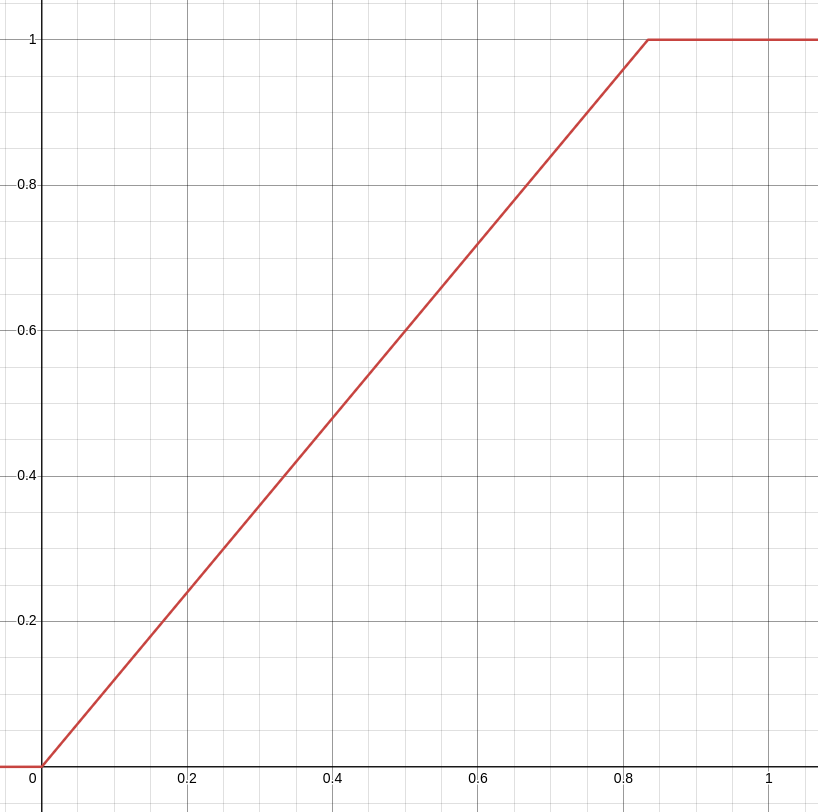

# Racebattle

Mockup:

## Controls

- helicopter-like movement
  
  - move in direction
  
  - use touchpad to control direction
  
  - touchpad center is speed 0, and near edge of touchpad is max speed
  
  - change in direction and speed is not instant. Intentionally floaty controls

- target max speed goes from 0% to 100% depending on how far from the center the touch is on the touchpad, using formula `min(1.0, pad.radius()/1000*1.2)` (pad radius goes from 0-1000)
  

- the slower the firefly is moving, the tighter it can turn

## Obstacles

- ponds to jump over or avoid (you fly slower over them)

- trees to avoid

- wind tunnels that give you speedup but less control

## Goals

- Reach checkpoints

- Multiple laps

- Final checkpoint is the goal
